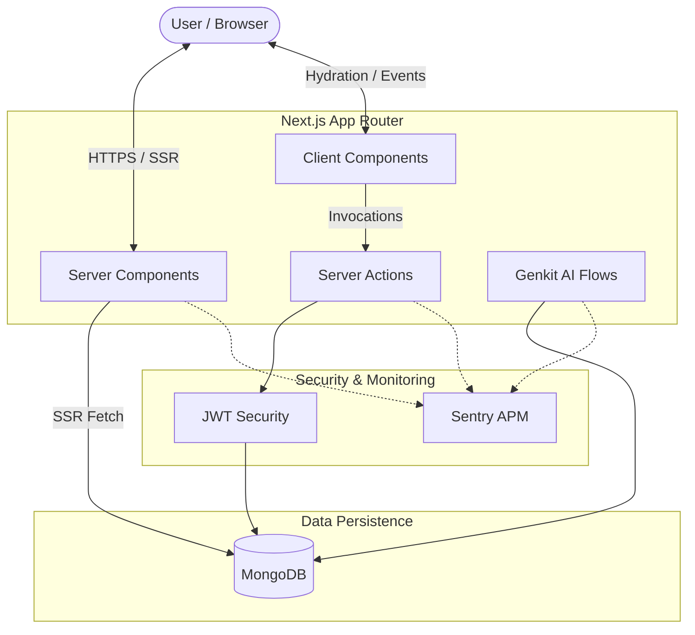

# System Architecture

This document outlines the high-level architecture of the Mohammed Khizer Portfolio, highlighting the transition to a production-grade, secure, and performant system.

## High-Level Diagram

## Core Principles

1.  **Server-First Rendering**: Primary portfolio content is rendered server-side to ensure maximum SEO and minimum Time-to-Interactive (TTI).
2.  **Zero-Trust Database Access**: All database access is conducted server-side using Mongoose and MongoDB. Identity and actions are verified using secure JWT mechanisms.
3.  **Observability by Default**: Sentry tracks every error and performance bottleneck across both client and server boundaries.
4.  **Decoupled AI Intelligence**: The Genkit AI engine is decoupled from hardcoded data, fetching live portfolio context dynamically from MongoDB.

## Data Flow: Project Recommendation

1.  User enters an interest in the UI.
2.  The request is sent to a **Server Action**.
3.  The Server Action triggers the **Genkit AI Flow**.
4.  The Flow fetches all projects via Mongoose from MongoDB.
5.  Projects are injected into the **Gemini Flash** prompt as structured context.
6.  Recommendations are returned to the user with a keyword-match **fallback** if AI services are unavailable.
